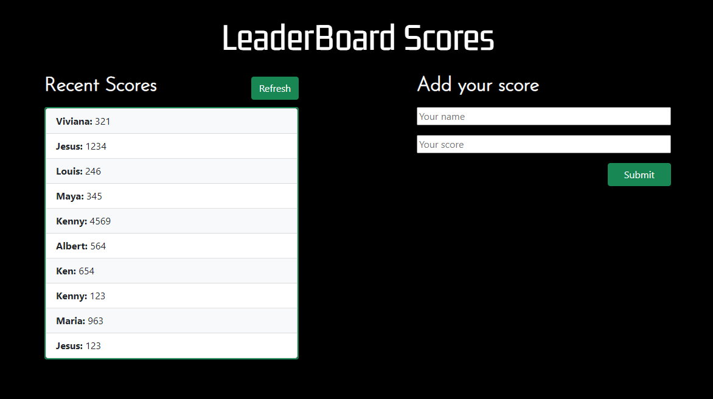

# LeaderBoard with API



> Simple app that calls an API to fetch the scores, also you can add your score of a game.

## 👷🏻 Built with

- Vanilla JavaScript
- ESLint
- WebPack
- Swal
- Bootstrap
- GIT
- VSCode

## 🌐 Live Preview

> You can visit a live preview of the app right here

[Live preview](https://kensayo.github.io/leaderbordWithAPI/)

## 👨🏻‍🔧 Setup

> To get a local copy up and running follow these simple example steps.

- Open terminal
- Clone this project by command git clone  ```https://github.com/kensayo/leaderbordWithAPI.git```
- Open terminal and move to the root folder and then to ```dist``` folder
- Run ```code .``` and run live server from VSCode
- Open your browser and go to [127.0.0.1](127.0.0.1)

## Author

**👤 Kenny Ortega**

- GitHub: [kensayo](https://github.com/kensayo)
- Twitter: [@kensayo](https://twitter.com/kensayo)
- LinkedIn: [LinkedIn](https://www.linkedin.com/in/kenny-ortega/)


## 🤝 Contributing

> Contributions, issues, and feature requests are welcome!

> Feel free to check the [issues page](../../issues/).

## 🤩 Show your support

> Give a ⭐️ if you like this project!

## 👨🏻‍🎓 Acknowledgments

- [Microverse](https://www.microverse.org/)
